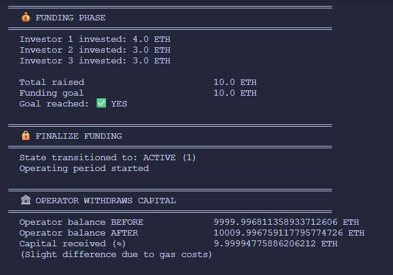
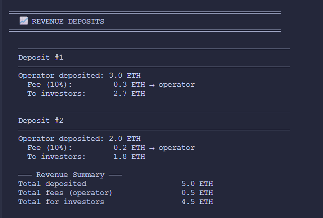
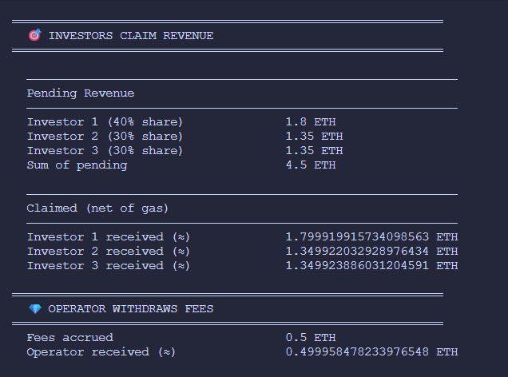
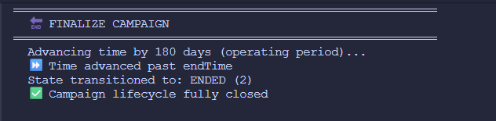
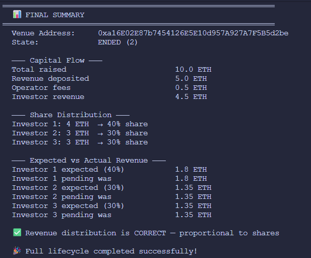

# VenueFi — Smart Contracts

VenueFi is a Real World Asset (RWA) revenue-sharing protocol that allows operators to raise capital from investors, deploy it into a real-world venue or business, and distribute revenue proportionally back to investors on-chain.

VenueFi supports multiple independent venue campaigns through the `VenueFactory` contract.

---

## Architecture

```text
VenueFactory
   ├── VenueFi #1
   ├── VenueFi #2
   ├── VenueFi #3
   └── ...
```

Each VenueFi instance represents an independent funding campaign with its own:

* Funding goal
* Funding duration
* Operating duration
* Revenue accounting
* Investor balances
* Operator fee configuration

The factory is responsible only for deployment and discovery of campaigns.

---

## How It Works

The protocol has three distinct phases:

### FUNDING

Investors deposit ETH and receive shares proportional to their contribution.

The campaign has:

* A funding deadline
* A minimum funding goal

If the goal is not reached before the deadline:

* Anyone may call `expireFunding()`
* The campaign transitions to `ENDED`
* Investors can reclaim their original investment through `refund()`

---

### ACTIVE

Once the funding goal is reached:

* Anyone may call `finalizeFunding()`
* The venue enters the ACTIVE state
* The operator may withdraw the raised capital

During this phase:

* The operator deploys capital into a real-world business
* Revenue can be deposited on-chain
* Investors accumulate claimable revenue

The active period lasts for a fixed operating duration determined at deployment.

Revenue deposits are only accepted before `endTime`.

---

### ENDED

After the operating period ends:

* Anyone may call `finalizeCampaign()`
* The venue transitions to `ENDED`

No additional revenue can be deposited.

Investors may still claim any accumulated revenue.

---

## Contract Lifecycle

```text
FUNDING ─────────────► ACTIVE ─────────────► ENDED
   │                                          ▲
   │                                          │
   └──────── expireFunding() ─────────────────┘
```

---

## Share Model

Shares are internal accounting units and are intentionally non-transferable.

Characteristics:

* 1 wei invested = 1 share
* No ERC20 token is minted
* No ERC721 token is minted
* No transfer mechanism exists
* No secondary market exists

Investors can:

* Hold shares
* Claim revenue
* Refund capital if funding fails

This design significantly simplifies accounting and reduces protocol complexity.

---

## Core Functions

| Function                 | Caller   | State          | Purpose                                      |
| ------------------------ | -------- | -------------- | -------------------------------------------- |
| `invest()`               | Anyone   | FUNDING        | Deposit ETH and receive shares               |
| `finalizeFunding()`      | Anyone   | FUNDING        | Activate venue after funding goal is reached |
| `expireFunding()`        | Anyone   | FUNDING        | Expire failed campaign                       |
| `refund()`               | Investor | ENDED          | Recover invested capital                     |
| `withdrawCapital()`      | Operator | ACTIVE         | Withdraw raised capital                      |
| `depositRevenue()`       | Operator | ACTIVE         | Deposit business revenue                     |
| `claimRevenue()`         | Investor | ACTIVE / ENDED | Claim accumulated revenue                    |
| `withdrawOperatorFees()` | Operator | ACTIVE / ENDED | Withdraw accrued fees                        |
| `finalizeCampaign()`     | Anyone   | ACTIVE         | End campaign after operating period          |

---

## Revenue Distribution

Revenue is distributed using an accumulator model inspired by MasterChef.

```solidity
accRevenuePerToken += (investorRevenue * PRECISION) / totalSupply;

pending(user) =
    (balance[user] * accRevenuePerToken) / PRECISION
    - rewardDebt[user];
```

This allows revenue accounting to remain:

* O(1) for deposits
* O(1) for claims
* Independent of investor count

---

### Revenue Mechanics

When the operator deposits revenue:

1. Operator fee is calculated
2. Fee is accrued internally
3. Remaining revenue is allocated proportionally
4. Investors claim independently

Benefits:

* No loops
* No investor iteration
* Scales efficiently

---

## State Machine Guarantees

The protocol enforces the following transitions:

### FUNDING → ACTIVE

Requirements:

* Funding goal reached

---

### FUNDING → ENDED

Requirements:

* Deadline passed
* Funding goal not reached

---

### ACTIVE → ENDED

Requirements:

* Operating period completed

---

### Invalid Transitions

The following are impossible:

* ACTIVE → FUNDING
* ENDED → ACTIVE
* ENDED → FUNDING

The state machine is strictly forward-only.

---

## Design Decisions

### Trusted Operator Model

VenueFi intentionally assumes a trusted operator.

The operator:

* Controls business operations
* Withdraws raised capital
* Chooses when to deposit revenue

This mirrors real-world RWA structures where operators remain legally accountable outside the blockchain.

Mitigations:

* Fixed operating period
* Transparent on-chain accounting
* Permissionless campaign finalization

---

### Claims After Finalization

Revenue claims remain available after the campaign ends.

Otherwise, earned revenue could become permanently locked.

---

### Non-Transferable Shares

Shares are not tokenized.

Advantages:

* Simpler accounting
* Smaller attack surface
* Easier auditing
* No secondary-market complexity

---

### Reentrancy Protection

External value transfers follow:

* Checks
* Effects
* Interactions

Additionally:

* `nonReentrant` is applied where appropriate
* OpenZeppelin `ReentrancyGuard` is used as defense-in-depth

---

### Immutable Fee Structure

Operator fees:

* Are defined during deployment
* Cannot be modified later
* Are capped at 100%

---

## Security Considerations

| Risk                             | Severity | Mitigation                          |
| -------------------------------- | -------- | ----------------------------------- |
| Operator disappears with capital | High     | Off-chain legal enforcement         |
| Operator never deposits revenue  | High     | Trust-based model                   |
| Operator generates no revenue    | High     | Trust-based model                   |
| Revenue capture attack           | Medium   | rewardDebt accounting               |
| Reentrancy                       | Low      | CEI + ReentrancyGuard               |
| Fee manipulation                 | Low      | Immutable fee configuration         |
| Rounding dust                    | Low      | Minimal residual balances           |
| Arithmetic overflow              | Low      | Solidity 0.8.x built-in protections |

---

## Venue Deployment Parameters

```solidity
constructor(
    uint256 _fundingDeadline,
    uint256 _operatingDuration,
    uint256 _fundingGoal,
    address _operator,
    uint256 _operatorFeePercentage
)
```

---

## Lifecycle Simulation

The protocol lifecycle has been simulated end-to-end using Hardhat scripts.

Covered flows include:

* Funding
* Activation
* Capital withdrawal
* Revenue deposits
* Revenue claims
* Campaign finalization

### Funding Phase



---

### Revenue Deposits



---

### Revenue Claims



---

### Campaign Finalization



---

### Final Summary



---

## Test Coverage

Current coverage:

* 100% Statements
* 100% Functions
* 100% Lines

Known exception:

* Defensive underflow branch inside `pending()`
* Unreachable during normal execution
* Covered through dedicated test harness

---

## Development

Install dependencies:

```bash
npm install
```

Compile contracts:

```bash
npx hardhat compile
```

Run tests:

```bash
npx hardhat test
```

Generate coverage:

```bash
npx hardhat coverage
```

---

## Technology Stack

* Solidity 0.8.20
* Hardhat
* OpenZeppelin Contracts
* Ethers.js v6
* Chai
* Hardhat Network Helpers

---

## License

MIT License
